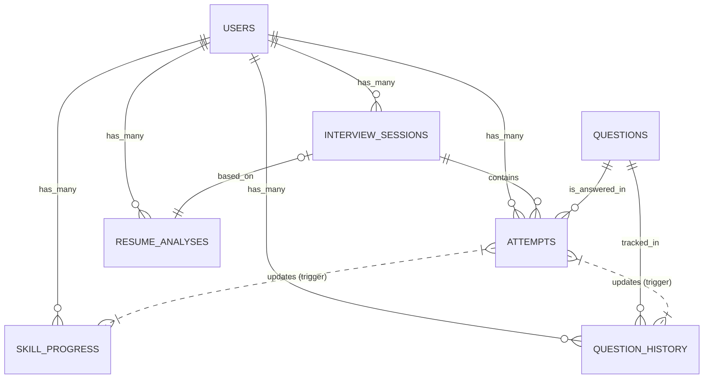

# 🗄️ Database Schema Reference using Supabase

> **Scope**: Full reference of the PostgreSQL database, including tables, RLS policies, triggers, and functions.
> **Source**: `backend/database/final_schema.sql`

Table of Contents:
1.  [Entity Relationship Diagram](#entity-relationship-diagram)
2.  [Tables & Columns](#tables--columns)
3.  [Row Level Security (RLS)](#row-level-security-rls)
4.  [Functions & Triggers](#functions--triggers)

---

## 1. Entity Relationship Diagram

---

## 2. Tables & Columns

### 3a. `users` (Extends `auth.users`)
Stores profile information. Automatically created via trigger when a user signs up.

| Column | Type | Default | Description |
|:---|:---|:---|:---|
| `id` | UUID (PK) | - | References `auth.users.id`. |
| `email` | TEXT | - | User's email address. |
| `full_name` | TEXT | - | Display name. |
| `preferences` | JSONB | `{}` | User settings/preferences. |
| `target_role` | TEXT | - | Targeted job role (e.g., "PM"). |
| `total_attempts` | INT | 0 | Aggregate counter. |
| `average_score` | DECIMAL | 0 | Rolling average of all attempts. |
| `current_streak` | INT | 0 | Consecutive days of practice. |

### 3b. `interview_sessions`
Represents a single "mock interview" session (typically 5-10 questions).

| Column | Type | Default | Description |
|:---|:---|:---|:---|
| `id` | UUID (PK) | `uuid_v4()` | Unique Session ID. |
| `user_id` | UUID (FK) | - | Owner. |
| `domain` | TEXT | 'general' | Interview domain. |
| `status` | TEXT | 'in_progress' | `in_progress`, `completed`, `abandoned`. |
| `consolidated_feedback` | JSONB | - | Final session summary from LLM. |
| `resume_analysis_id` | UUID (FK) | - | Optional link to resume used. |

### 3c. `questions`
The master question bank.

| Column | Type | Default | Description |
|:---|:---|:---|:---|
| `id` | SERIAL (PK) | - | Unique ID. |
| `question` | TEXT | - | The question text. |
| `ideal_answer` | TEXT | '' | Reference for scoring. |
| `category` | TEXT | - | `behavioral`, `technical`, etc. |
| `difficulty` | TEXT | 'medium' | `easy`, `medium`, `hard`. |
| `is_custom` | BOOLEAN | FALSE | `TRUE` if added by user. |

### 3d. `attempts`
Individual answers to questions. The most data-heavy table.

| Column | Type | Default | Description |
|:---|:---|:---|:---|
| `id` | SERIAL (PK) | - | Unique Attempt ID. |
| `user_id` | UUID (FK) | - | User owner. |
| `question_id` | INT (FK) | - | Question answered. |
| `transcript` | TEXT | - | Speech-to-text result. |
| `audio_file_url` | TEXT | - | Path in storage bucket (optional). |
| `final_score` | DECIMAL | 0 | Overall 0-100 score. |
| `ml_scores` | JSONB | `{}` | Detailed 6-score breakdown. |
| `llm_feedback` | JSONB | `{}` | Structured feedback (tips, strengths). |
| `voice_analysis` | JSONB | `{}` | Pitch/Volume/Energy metrics. |

### 3e. `resume_analyses`
Stores parsed resume data and AI feedback.

| Column | Type | Description |
|:---|:---|:---|
| `resume_text` | TEXT | Extracted text content. |
| `skill_match_pct` | DECIMAL | 0-100 match against JD. |
| `missing_skills` | TEXT[] | Arrays of skills. |
| `matched_skills` | TEXT[] | Arrays of skills. |
| `feedback` | JSONB | LLM Analysis. |

### 3f. `skill_progress`
Aggregated stats per skill (Content, Delivery, etc.).

| Column | Type | Description |
|:---|:---|:---|
| `skill_name` | TEXT | `content`, `delivery`, `communication`, ... |
| `current_avg` | DECIMAL | Current moving average. |
| `trend` | TEXT | `improving`, `stable`, `declining`. |
| `score_history` | JSONB | Last 100 data points for charts. |

---

## 3. RLS Policies (Security)
Row Level Security is **ENABLED** on all tables.

| Table | Policy Name | Logic |
|:---|:---|:---|
| `users` | View own profile | `auth.uid() = id` |
| `attempts` | View own attempts | `auth.uid() = user_id` |
| `interview_sessions` | View own sessions | `auth.uid() = user_id` |
| `questions` | Public Read | `is_active = TRUE` |
| `questions` | Update Own Custom | `uploaded_by = auth.uid()` |

> **Note**: The Backend uses the `service_role` key to bypass these checks for system-level operations, but all Frontend requests are scoped to the user's token.

---

## 4. Functions & Triggers
Business logic embedded in the database.

### `handle_new_user()`
*   **Trigger**: `AFTER INSERT ON auth.users`
*   **Action**: Creates a corresponding row in `public.users` with email and default preferences.

### `update_skill_progress()`
*   **Trigger**: `AFTER INSERT ON public.attempts`
*   **Action**:
    1.  Reads the 6 sub-scores (`content`, `delivery`...).
    2.  Updates `skill_progress` table for each skill.
    3.  Recalculates moving average and trend direction.
    4.  Appends to `score_history` JSON.

### `update_user_stats()`
*   **Trigger**: `AFTER INSERT ON public.attempts`
*   **Action**:
    1.  Updates `users.total_attempts`, `users.average_score`.
    2.  Updates/Creates `practice_sessions` for the current day (Streak logic).

### `update_question_history()`
*   **Trigger**: `AFTER INSERT ON public.attempts`
*   **Action**: Updates `question_history` to track how many times this specific question has been asked and the user's best/worst score on it.

---

## 5. Storage Buckets (File System)

| Bucket Name | Privacy | Usage | File Limit |
|:---|:---|:---|:---|
| `audio-recordings` | Private | Interview answer audio clips. | 50 MB |
| `resumes` | Private | User uploaded resumes. | 10 MB |
| `avatars` | Public | User profile pictures. | 2 MB |

**Storage Policies**:
*   `Users can upload own audio`: `bucket_id = 'audio-recordings' AND auth.uid() = folder_name`
*   (Similar strict folder-based isolation for all private buckets).
